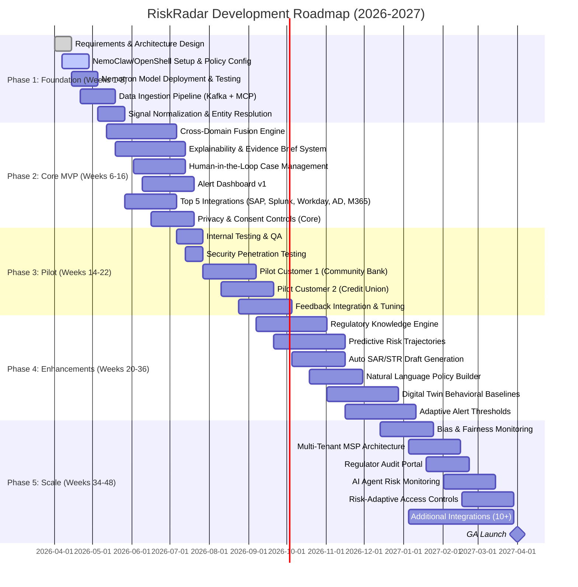

# RiskRadar: AI-Driven Organizational Risk Intelligence Platform
## Comprehensive Design Document — March 2026

---

## Executive Summary

RiskRadar is an enterprise risk monitoring and early-warning platform powered by OpenClaw (v2026.3.22+) and NVIDIA NemoClaw. It uses sandboxed, always-on AI agents running frontier open-source reasoning models to continuously ingest and correlate signals across enterprise systems — employee behavior, financial transactions, security events, operational metrics, and compliance data — to detect compound risk patterns weeks or months before incidents occur.

**What makes RiskRadar different from every competitor:**

1. **Cross-domain risk fusion** — Correlates signals across HR, finance, security, operations, and communications in a single platform. No competitor does this.
2. **On-premises frontier reasoning AI** — Nemotron-3-Super (120B) and Nemotron-Cascade-2 (30B) deliver reasoning-capable AI that never sends data off-premises.
3. **Regulator-ready explainability** — Natural language evidence briefs with full audit trails, not opaque risk scores.
4. **Days-to-value deployment** — Reasoning models work from day one without weeks of ML baselining.
5. **Mid-market accessible pricing** — Starting at $2-5K/month, vs. competitors at $67K-$500K+/year.
6. **NemoClaw sandboxing** — Every agent runs in policy-controlled isolation with deny-by-default networking. No competitor offers built-in agent sandboxing.

**Target Market:** Regulated industries (banking, healthcare, insurance, manufacturing) with 50-5,000 employees who face compliance mandates but are priced out of enterprise tools.

**Primary Buyer Personas:** Chief Compliance Officer, CISO, VP Internal Audit, BSA Officer.

---

## Part 1: Technology Foundation

### 1.1 OpenClaw v2026.3.22 — Platform Capabilities

OpenClaw is the open-source (MIT-licensed) autonomous AI agent framework that serves as RiskRadar's core runtime. As of v2026.3.22 (March 23, 2026), it provides:

**Core Architecture:**
- Single Gateway process (Node.js) managing multi-channel routing and isolated sessions
- Agents maintain long-term memory, invoke tools (APIs, scripts, browsers), and operate continuously
- 48-hour agent session timeout (up from 10 minutes) — critical for always-on monitoring
- Pluggable sandbox backends for configurable isolation
- ContextEngine plugin interface for swap-in/swap-out context management strategies

**Multi-Channel Integration:**
- WhatsApp, Telegram, Discord, Microsoft Teams, Slack, Signal, iMessage, Matrix, IRC, SMS, Email, WeChat (via ClawBot plugin)
- Voice input/output on mobile platforms
- Alerts routed through any channel the organization already uses

**Multi-Agent Architecture (3 Tiers):**
- **SubAgent** — Child agents for simple delegation (e.g., a data collection sub-agent)
- **Agent Teams** — Team-based collaboration (e.g., finance monitoring team + security monitoring team)
- **AgentToAgent** — Cross-agent communication (e.g., HR agent alerts security agent about access anomaly)
- Each agent gets isolated workspaces (SOUL.md, AGENTS.md, USER.md), separate auth/sessions, and dedicated storage

**Skills & Plugin System:**
- ClawHub marketplace with 13,729+ community-built skills
- New Plugin SDK (`openclaw/plugin-sdk/*`) replacing legacy extension API
- Skills stored in `~/.openclaw/skills` with YAML frontmatter configuration
- Native search tool integrations: Exa, Tavily, Firecrawl
- Composio integration for 860+ external tool connectors

**MCP (Model Context Protocol) Support:**
- Full MCP support via `mcporter` CLI tool
- 500+ community-built MCP servers (GitHub, Notion, Slack, Linear, Jira, Confluence, Stripe, Shopify, etc.)
- Headless MCP tools fire on cron schedules or message triggers
- Critical for RiskRadar: enables plug-and-play integrations with enterprise systems

**Control Dashboard v2:**
- Modular overview with chat, config, agent, and session views
- Command palette, mobile bottom tabs, slash commands
- Search, export, and pinned messages
- `/btw` command for quick side-queries without triggering tool use

**Security Hardening (v2026.3.22):**
- Browser origin validation for WebSocket connections
- Exec approval settings per-agent
- Canvas route authentication
- Pluggable sandbox backends

### 1.2 NemoClaw — Enterprise Security Layer

NemoClaw (announced GTC 2026, March 16) is NVIDIA's enterprise wrapper that "hardens" OpenClaw for production:

**OpenShell Runtime:**
- Single-command install of NVIDIA Nemotron models + OpenShell runtime
- Each agent runs in an isolated sandbox (Linux container) with:
  - Landlock LSM (Linux Security Module)
  - seccomp system call filtering
  - Filesystem namespace isolation
  - Network namespace isolation
  - Dedicated sandbox user per agent
- Four layers of isolation prevent data leaks, unauthorized access, and resource abuse

**Policy Engine:**
- YAML-based policies define allowed endpoint groups (APIs, hosts, file paths)
- **Deny-by-default networking** — agents can only reach whitelisted endpoints
- Operator approval dialog for any unapproved network call
- Dynamic policy updates without agent restart
- Resource limits (CPU shares, memory caps) per agent

**Privacy Router:**
- Routes between local open models (Nemotron) and cloud frontier models
- Strips PII before sending reasoning requests to external APIs
- Three-tier inference: local fast → local deep reasoning → cloud (PII-stripped)
- Configurable per query type and data sensitivity level

**Logging & Audit:**
- Every network request, file access, tool invocation, and decision recorded
- Attributable to specific agent and user context
- Immutable audit trail for regulatory examination

**Hardware Support:**
- GeForce RTX PCs/laptops (development/small deployments)
- RTX PRO workstations (pilot deployments)
- DGX Station / DGX Spark (production deployments)
- Linux required (Ubuntu 22.04+)

### 1.3 AI Model Strategy

#### Primary Models for RiskRadar

We use a **three-tier model architecture** optimized for cost, speed, and reasoning depth:

**Tier 1 — Always-On Monitoring: Nemotron-3-Super-120B-A12B**

| Attribute | Detail |
|---|---|
| Total Parameters | 120B |
| Active Parameters | ~12B (MoE) |
| Architecture | Hybrid Mamba-2 Transformer Latent MoE + Multi-Token Prediction |
| Context Window | **1M tokens** |
| Hardware | Single RTX workstation or DGX |
| License | Open weights |
| Role | Continuous signal ingestion, pattern matching, anomaly detection, routine alerting |
| Why | 1M context ingests massive audit logs in one pass; 12B active = fast inference; purpose-built for multi-agent agentic reasoning |

**Tier 2 — Deep Reasoning Escalation: Nemotron-Cascade-2-30B-A3B**

| Attribute | Detail |
|---|---|
| Total Parameters | 30B |
| Active Parameters | ~3B (MoE) |
| Architecture | MoE, post-trained via Cascade RL + Multi-Domain On-Policy Distillation |
| Modes | Thinking (reasoning) and Instruct (non-reasoning) |
| Hardware | Single RTX 4090 / RTX 5090 |
| License | Open weights |
| Achievement | **Gold Medal** on 2025 IMO, IOI, and ICPC World Finals |
| Role | Complex fraud pattern analysis, multi-step regulatory reasoning, evidence chain construction, explainability generation |
| Why | Gold-medal reasoning with only 3B active params; runs on same hardware as Tier 1; handles the 4-5% of cases that need deep analysis |

**Tier 3 — Cloud Fallback (Optional): Privacy-Routed External API**

| Attribute | Detail |
|---|---|
| Models | Claude Opus 4.6, GPT-5.4, or other frontier models |
| Routing | NemoClaw Privacy Router strips PII before sending |
| Role | Last-resort for truly novel patterns (< 1% of cases) |
| Why | Handles edge cases without compromising data privacy |

#### Alternative / Supplementary Models Available

| Model | Params (Total/Active) | Context | License | Use Case |
|---|---|---|---|---|
| Llama-Nemotron-Super-49B | 49B / ~49B | 128K | Llama Community | Single-GPU reasoning with toggleable thinking |
| Llama-Nemotron-Nano-8B | 8B | 128K | Llama Community | Edge/branch deployments on minimal hardware |
| Nemotron-3-Nano-30B-A3B | 30B / ~3B | 1M | Open | Lightweight edge monitoring |
| DeepSeek-R1 (distilled 32B) | 32B | 128K | MIT | Cost-sensitive secondary reasoning |
| Mistral Small 4 | 119B / ~6B | 128K | Apache 2.0 | Multilingual deployments |
| Qwen 3.5 Small (9B) | 9B | 128K | Apache 2.0 | On-device / edge deployments |
| Gemma 3 (27B) | 27B | 128K | Gemma License | Multimodal analysis (document/image review) |

#### Model Inference Architecture

```
Enterprise Data Signals (audit logs, transactions, communications, access logs)
                    │
                    ▼
┌──────────────────────────────────────────────────┐
│  Tier 1: Nemotron-3-Super-120B (12B active)      │
│  ┌────────────────────────────────────────────┐  │
│  │ 1M context window                          │  │
│  │ Continuous ingestion & pattern matching     │  │
│  │ Anomaly detection & correlation            │  │
│  │ Routine alert generation                   │  │
│  │ Handles ~95% of all analysis               │  │
│  └──────────────┬─────────────────────────────┘  │
│                 │ Ambiguous / complex case?       │
│                 ▼                                 │
│  ┌────────────────────────────────────────────┐  │
│  │ Tier 2: Nemotron-Cascade-2 (3B active)     │  │
│  │ Deep chain-of-thought reasoning            │  │
│  │ Multi-step fraud logic analysis            │  │
│  │ Evidence chain construction                │  │
│  │ Regulatory requirement mapping             │  │
│  │ Natural language explanation generation     │  │
│  │ Handles ~4% of cases                       │  │
│  └──────────────┬─────────────────────────────┘  │
│                 │ Still unresolved? (<1%)         │
│                 ▼                                 │
│  ┌────────────────────────────────────────────┐  │
│  │ Tier 3: Cloud API (PII-stripped)           │  │
│  │ Via NemoClaw Privacy Router                │  │
│  │ Frontier models for novel patterns         │  │
│  │ No sensitive data leaves premises          │  │
│  └────────────────────────────────────────────┘  │
└──────────────────────────────────────────────────┘
```

#### Why NOT Other Models?

| Model | Why Skip for Primary Use |
|---|---|
| Nemotron-3-Ultra-500B | Not yet released; requires 8xH100 ($200K+ hardware) — future upgrade path |
| Llama-Nemotron-Ultra-253B | Same hardware problem; 128K context vs. Super's 1M |
| DeepSeek-V3.2 (685B) | Massive infra requirements; data sovereignty concerns (Chinese origin) |
| GLM-5 (744B) | Requires multi-node cluster; unproven in enterprise agent use |
| Kimi K2.5 (1T) | Impractical hardware requirements for on-prem |

**Upgrade Path:** When Nemotron-3-Ultra-500B ships (H1 2026), it becomes the Tier 1 replacement for customers with DGX infrastructure, pushing Super to Tier 1 for mid-market.

---

## Part 2: Competitive Landscape

### 2.1 Comprehensive Competitor Analysis

We analyzed 23 competitors across four categories. Here are the key players and their critical weaknesses:

#### Category A: GRC Platforms (Governance, Risk, Compliance)

| Competitor | What They Do | Pricing | Key Weakness |
|---|---|---|---|
| **LogicGate Risk Cloud** | No-code GRC with Spark AI | Modular SaaS ($250K-$1M) | No AI governance capabilities; performance lags with large datasets; 15% annual price increases |
| **IBM OpenPages** | AI-driven GRC with Watson | Enterprise license (high) | On-prem installation complexity; prohibitive cost for mid-market |
| **RSA Archer (Evolv)** | Enterprise GRC framework | Enterprise subscription | Heavyweight implementation; heavy customization needs |
| **ServiceNow GRC** | GRC integrated with ITSM | Bundled enterprise | Less specialized analytics; platform dependency |
| **MetricStream** | ERM with KRI alerting | Enterprise subscription | Large-scale custom implementation; high cost |
| **Riskonnect** | Cloud SaaS integrated risk | SaaS subscription | Weak on advanced AI analytics |
| **AuditBoard/Optro** | Internal audit + risk | Enterprise subscription | Limited third-party AI; rebranding confusion |
| **OneTrust** | Privacy/GDPR + risk | Module-based | Narrow focus (privacy vs. operational monitoring) |

**Category Gap:** GRC platforms manage risk registers and workflows but **don't detect risks autonomously**. They document known risks; RiskRadar discovers unknown ones.

#### Category B: Insider Threat / UEBA

| Competitor | What They Do | Pricing | Key Weakness |
|---|---|---|---|
| **DTEX Systems** | Insider risk with behavioral DLP | $150K+ entry | Very expensive; limited integrations; not customizable; steep learning curve |
| **Exabeam** | SIEM + UEBA (500+ behavioral models) | $250/user/year | Outdated UI; complex setup; small market share (1.6%) |
| **Securonix** | Unified SIEM + UEBA + SOAR | $67K+/year | Needs dedicated SMEs; slow tuning; large-org-only |
| **Darktrace** | Self-learning AI cyber detection | Premium custom | Over-marketed AI, under-delivers; high false positives; losing market share (16.8%, down from 25.4%) |
| **Gurucul** | UEBA + risk analytics | Undisclosed | Platform instability; poor documentation; 7.2/10 rating |
| **Proofpoint ITM** | Insider threat monitoring | $100K+/year | Rule-based; no remote control; integration friction; high false positives |

**Category Gap:** UEBA tools focus on security anomalies but **don't correlate with compliance, HR, or financial signals**. They detect threats but can't explain them in regulatory language.

#### Category C: Employee Monitoring / DLP

| Competitor | What They Do | Pricing | Key Weakness |
|---|---|---|---|
| **Teramind** | Employee monitoring + DLP | $15/user/month+ | No Linux; weak Mac support; inconsistent UX; monitoring drops without notice |
| **Forcepoint** | DLP + insider threat | User-based (expensive) | Heavy agent; forces vendor lock-in; complex deployment |
| **Veriato** | Behavioral visibility (200+ signals) | Enterprise | Mainly security/HR focus; no finance or customer data coverage |
| **Varonis** | Data security + insider threat | Escalating SaaS | Expensive add-ons; Microsoft-centric; forced cloud migration (on-prem EOL Dec 2026) |

**Category Gap:** Monitoring tools watch employee activity but are **perceived as surveillance**, creating legal/PR risk. They lack the compliance and risk intelligence framing that makes monitoring defensible.

#### Category D: Platform / Ecosystem Players

| Competitor | What They Do | Pricing | Key Weakness |
|---|---|---|---|
| **Microsoft Purview IRM** | M365-native insider risk | E5 license required | "Still maturing"; users report no actionable alerts; M365-locked; no on-prem |
| **NICE Actimize** | Financial crime (AML/fraud) | $500K+ modular | "Painfully slow" implementation; poor documentation; slow performance |
| **Pathlock** | ERP access/SoD governance | Enterprise (undisclosed) | No behavioral analytics; complex setup; narrow scope (access controls only) |
| **KonaAI** | Banking compliance analytics | ~1/5 traditional cost | Tiny market presence; narrow ERP focus; no security integrations |

**Category Gap:** Platform players are either locked to specific ecosystems (Microsoft, SAP) or priced for Fortune 500 only.

### 2.2 Universal Competitor Shortcomings

After analyzing all 23 competitors, **seven systemic problems appear across the entire market:**

| # | Problem | Impact | RiskRadar Solution |
|---|---|---|---|
| 1 | **Months-long deployment** | Customers wait 3-12 months for value | Reasoning models work day one; no baselining period needed |
| 2 | **False positive overload** | Alert fatigue kills adoption | Multi-signal correlation + reasoning reduces noise; adaptive thresholds |
| 3 | **Single-domain coverage** | Compound risks invisible | Cross-domain fusion across HR, finance, security, operations |
| 4 | **Opaque AI decisions** | Regulators can't audit; users don't trust | Chain-of-thought evidence briefs with source citations |
| 5 | **Cloud-only or cloud-forcing** | Regulated industries need on-prem | NemoClaw on-prem first; data never leaves the building |
| 6 | **Enterprise-only pricing** | Mid-market priced out | $2-5K/month starter tier |
| 7 | **No autonomous reasoning** | Rule-based or basic ML only | Frontier reasoning models (Nemotron-Cascade-2: Gold Medal IMO/IOI/ICPC) |

### 2.3 Competitor Feature Matrix

| Feature | LogicGate | IBM OpenPages | Archer | NICE Actimize | DTEX | Securonix | Darktrace | MS Purview | Veriato | **RiskRadar** |
|---|---|---|---|---|---|---|---|---|---|---|
| Cross-Domain Risk Fusion | No | Partial | Partial | No | No | No | No | No | Partial | **Yes** |
| Sandboxed Agent Execution | No | No | No | No | No | No | No | No | No | **Yes** |
| On-Prem Reasoning AI | No | No | No | No | No | No | Proprietary ML | No | No | **Yes (Nemotron)** |
| Explainable AI (CoT) | No | No | Partial | No | No | No | No | No | No | **Yes** |
| Natural Language Policies | No | No | No | No | No | No | No | No | No | **Yes** |
| Regulatory Knowledge Engine | No | Partial | Partial | Yes (AML) | No | No | No | No | No | **Yes (multi-reg)** |
| Auto SAR/STR Generation | No | No | No | Partial | No | No | No | No | No | **Yes** |
| Predictive Risk Trajectories | No | No | No | No | No | No | No | No | No | **Yes** |
| Adaptive Alert Thresholds | No | No | No | No | No | Partial | Partial | Partial | No | **Yes** |
| Privacy/Anonymization | No | No | No | No | No | No | No | No | Yes | **Yes** |
| Employee Consent Mgmt | No | No | No | No | No | No | No | No | No | **Yes** |
| Human-in-Loop Workflow | Yes | Yes | Yes | Yes | Yes | Yes | Yes | Yes | Yes | **Yes** |
| Digital Twin Baselines | No | No | No | No | No | No | Partial | No | No | **Yes** |
| Multi-Tenant MSP | No | No | No | No | No | Yes | No | No | No | **Yes** |
| Bias & Fairness Checks | No | No | No | No | No | No | No | No | No | **Yes** |
| AI Agent Risk Monitoring | No | No | No | No | No | Partial | No | Planned | No | **Yes** |
| MCP Integrations (500+) | No | No | No | No | No | No | No | No | No | **Yes** |
| Day-One Value (No Baselining) | No | No | No | No | No | No | No | No | No | **Yes** |

---

## Part 3: Product Features & Enhancements

### 3.1 Core Features (Must-Have for MVP)

#### Feature 1: Cross-Domain Risk Fusion Engine

**What it does:** Correlates signals across HR, finance, security, communications, and operations to detect compound risk patterns invisible to single-domain tools.

**How it works:**
- Each data domain has a dedicated collector agent (OpenClaw SubAgent)
- Collectors normalize signals into a unified risk event schema
- The fusion agent (Nemotron-3-Super) correlates events across domains using its 1M context window
- Compound patterns are scored higher than isolated anomalies

**Example Detection:**
```
Day 1:  Employee skips mandatory compliance training      [HR signal]
Day 3:  Same employee's Slack activity drops 40%          [Communication signal]
Day 5:  Same employee accesses client data after hours    [Security signal]
Day 8:  Same employee processes 3 override transactions   [Finance signal]
Day 10: Same employee's peer interaction frequency drops  [Behavioral signal]

Individual tools see 5 isolated low-priority events.
RiskRadar sees a compound HIGH-RISK pattern escalating over 10 days.
```

**Integration Points:**
- OpenClaw multi-agent architecture (Agent Teams for domain collectors, AgentToAgent for cross-domain communication)
- NemoClaw policy engine whitelists only necessary data source APIs per agent
- Unified event schema stored in AlertDB

**Effort:** High (8-10 weeks)
**Business Value:** Primary differentiator. No competitor offers this.

---

#### Feature 2: Sandboxed Agent Execution

**What it does:** Every AI agent runs in NemoClaw/OpenShell policy-controlled isolation, ensuring data cannot leak and agents cannot access unauthorized resources.

**How it works:**
- Each monitoring agent runs in its own sandbox container (k3s pod)
- Four isolation layers: Landlock LSM, seccomp, filesystem namespace, network namespace
- YAML policies define allowed endpoint groups per agent
- Deny-by-default networking — agents reach only whitelisted APIs
- OpenShell TUI/web interface for security team to review and approve agent access attempts

**Policy Example (Finance Monitoring Agent):**
```yaml
agent: finance_monitor
network_policy:
  default: deny
  allow:
    - host: core-banking.internal:443
      purpose: "Transaction override audit log API"
    - host: sap.internal:8443
      purpose: "ERP expense report API"
    - host: nemotron-inference.local:8080
      purpose: "Local LLM inference"
file_policy:
  read:
    - /data/finance/exports/*.csv
  write:
    - /data/alerts/finance/
  deny:
    - /data/hr/*
    - /data/security/*
resource_limits:
  cpu: 2 cores
  memory: 8GB
  max_runtime: 48h
```

**Integration Points:**
- Native NemoClaw feature — configure sandboxes and policies
- OpenClaw pluggable sandbox backends (v2026.3.22)
- Per-agent exec approval settings

**Effort:** Medium (4-6 weeks — mostly configuration)
**Business Value:** Enterprise compliance requirement. Enables deployment in regulated environments where other AI tools are blocked.

---

#### Feature 3: Explainable AI & Evidence Briefs

**What it does:** Every alert includes a human-readable reasoning chain with source data citations, regulatory references, and recommended actions — not just a risk score.

**How it works:**
- When Tier 1 (Nemotron-Super) flags an anomaly, it escalates to Tier 2 (Nemotron-Cascade-2) for deep reasoning
- Cascade-2 runs in "Thinking" mode, producing a chain-of-thought analysis
- The reasoning chain is captured, structured, and presented as an evidence brief
- Each claim in the brief links to the specific data source and timestamp
- Regulatory references are automatically mapped (see Feature 8: Regulatory Knowledge Engine)

**Evidence Brief Format:**
```
┌─────────────────────────────────────────────────────────────┐
│  RISK ALERT #2026-0847                                      │
│  Subject: Employee #4821 (Finance Dept)                     │
│  Risk Level: HIGH (Compound Score: 91/100)                  │
│  Alert Type: Potential Unauthorized Transaction Activity     │
│  Generated: 2026-04-15 14:23:07 UTC                        │
│                                                             │
│  EVIDENCE CHAIN:                                            │
│  1. Mar 15 — Processed 3 wire transfers >$50K each with     │
│     manager override (baseline: 0.2 overrides/month)        │
│     Source: Core Banking API, tx_ids: [7821, 7822, 7825]    │
│                                                             │
│  2. Mar 14-18 — Direct supervisor on PTO                    │
│     Source: HRIS Calendar API, absence_id: A-2847           │
│     Correlation: Override clustering during supervisor      │
│     absence (p < 0.01 vs. historical pattern)               │
│                                                             │
│  3. Mar 14 — Accessed client records for recipient          │
│     accounts at 11:47 PM (outside business hours)           │
│     Source: AD Audit Log, event_ids: [E-9921, E-9922]       │
│                                                             │
│  4. Mar 15 — Two of three recipient accounts created        │
│     within 48hrs of transfer                                │
│     Source: Core Banking API, acct_ids: [A-1104, A-1105]    │
│                                                             │
│  REASONING:                                                 │
│  The combination of supervisor absence, after-hours         │
│  access, new recipient accounts, and override clustering    │
│  represents a compound risk pattern. Each signal alone is   │
│  low-severity, but together they match known indicators     │
│  for unauthorized transaction activity.                     │
│                                                             │
│  REGULATORY MAPPING:                                        │
│  • FinCEN Advisory 2025-A003: Red flag indicators 4, 7, 12 │
│  • BSA/AML Manual Section 8.4: Override monitoring          │
│  • OCC Bulletin 2024-15: Insider threat controls            │
│                                                             │
│  RECOMMENDED ACTIONS:                                       │
│  • Immediate: Freeze override privileges pending review     │
│  • Within 24hrs: BSA Officer review of transactions         │
│  • Within 72hrs: SAR filing assessment per 31 CFR 1020.320  │
│                                                             │
│  CONFIDENCE: 91% | FALSE POSITIVE LIKELIHOOD: Low           │
│  REASONING MODEL: Nemotron-Cascade-2 (Thinking mode)        │
│  PROCESSING TIME: 4.2 seconds                               │
│  FULL AUDIT TRAIL: /audit/2026/04/alert-0847.json          │
└─────────────────────────────────────────────────────────────┘
```

**Integration Points:**
- NemoClaw audit logging captures all intermediate reasoning steps
- OpenClaw agent memory stores evidence artifacts
- Dashboard renders evidence briefs with clickable source links

**Effort:** High (10-12 weeks)
**Business Value:** Critical differentiator. Transforms AI from a "black box" into an auditable, regulator-friendly tool. No competitor produces anything comparable.

---

#### Feature 4: Human-in-the-Loop Review & Case Management

**What it does:** All AI-generated alerts go through structured human review workflows before action is taken. Investigators can confirm, annotate, escalate, or dismiss findings.

**How it works:**
- Alert Dashboard shows prioritized queue of AI findings
- Each alert has a status lifecycle: `New → Under Review → Confirmed/Dismissed → Escalated → Resolved`
- Investigators add notes, attach documents, assign to team members
- Feedback loop: confirmed/dismissed decisions feed back to tune the adaptive threshold system
- Escalation rules auto-route high-severity alerts to specific roles

**Workflow:**
```
AI Alert Generated
      │
      ▼
┌─────────────┐    Auto-route by     ┌──────────────┐
│  Alert Queue │───severity/type────▶│  Assigned To  │
│  (Dashboard) │                     │  (Analyst)    │
└─────────────┘                     └──────┬───────┘
                                           │
                              ┌────────────┼────────────┐
                              ▼            ▼            ▼
                         ┌────────┐  ┌──────────┐  ┌─────────┐
                         │Confirm │  │ Dismiss  │  │Escalate │
                         │(+ notes│  │(+ reason)│  │(to mgr/ │
                         │        │  │          │  │ legal)  │
                         └───┬────┘  └────┬─────┘  └────┬────┘
                             │            │              │
                             ▼            ▼              ▼
                        ┌─────────┐  ┌─────────┐  ┌──────────┐
                        │Action   │  │Feedback │  │Executive │
                        │Taken    │  │Loop     │  │Review    │
                        │(SAR,etc)│  │(tune AI)│  │          │
                        └─────────┘  └─────────┘  └──────────┘
```

**Integration Points:**
- OpenClaw Control Dashboard v2 as the UI foundation
- NemoClaw policy engine for RBAC on case data
- OpenClaw notification channels for alert routing (Slack, Teams, Email, SMS)
- Integration with ServiceNow/JIRA for ticket creation

**Effort:** Medium (6-8 weeks)
**Business Value:** Legal requirement for any monitoring system. Ensures human judgment governs all actions.

---

#### Feature 5: Rich Enterprise Integrations

**What it does:** Pre-built connectors and APIs for common enterprise systems, leveraging OpenClaw's MCP support and ClawHub skills.

**Connector Matrix:**

| Category | System | Integration Method | Data Extracted |
|---|---|---|---|
| **HR/HRIS** | Workday | REST API / MCP | Employee records, leave, performance, training completion |
| | SuccessFactors | OData API | Same as above |
| | ADP | API | Payroll, time & attendance |
| | BambooHR | REST API | Employee lifecycle events |
| **Finance/ERP** | SAP S/4HANA | Business API / RFC | Transaction logs, overrides, expense reports, POs |
| | Oracle EBS | REST API | Budget tracking, invoice approvals |
| | NetSuite | SuiteTalk API | Financial KPIs, journal entries |
| **Security/SIEM** | Splunk | REST API / HEC | Security alerts, access logs, network events |
| | QRadar | REST API | SIEM events, offense data |
| | Microsoft Sentinel | Log Analytics API | Security incidents, sign-in logs |
| | CrowdStrike | Falcon API | Endpoint detection events |
| **Identity** | Azure AD / Entra | Microsoft Graph API | User directory, sign-in logs, role assignments |
| | Okta | REST API | Authentication events, MFA status |
| | CyberArk | REST API | Privileged access sessions |
| **Communication** | Microsoft 365 | Graph API | Email metadata (not content), calendar, Teams activity |
| | Slack | Events API | Channel activity metadata, response times |
| | Google Workspace | Admin SDK | Activity reports, login events |
| **CRM/Support** | Salesforce | REST API | Account health, deal velocity, escalations |
| | Zendesk | REST API | Ticket volume, CSAT, response times |
| | ServiceNow | REST API | Incident counts, SLA adherence |
| **Operations** | Jira | REST API | Sprint velocity, ticket completion, backlog |
| | GitHub/GitLab | REST API / Webhooks | Commit frequency, PR patterns, code review metrics |
| | PagerDuty | Events API | On-call alert patterns, MTTR |

**Integration Architecture:**
- OpenClaw MCP support enables plug-and-play with 500+ existing MCP servers
- ClawHub skills for common data source connectors
- OpenClaw agents call REST/GraphQL APIs with credentials stored in NemoClaw's secure environment
- NemoClaw policies whitelist only approved API endpoints per agent
- ETL pipelines for batch data (Kafka/Airflow) for high-volume streaming sources

**Effort:** Medium per connector (2-3 weeks each); framework is 4-6 weeks
**Business Value:** Rapid deployment — customers see value in days, not months. Each connector is a potential upsell.

---

#### Feature 6: Alert Dashboard & Visualization

**What it does:** A unified dashboard showing real-time risk posture across all monitored domains, with drill-down capabilities.

**Dashboard Components:**
- **Risk Heatmap** — Organization-wide risk by department/function (color-coded)
- **Alert Timeline** — Chronological view of all alerts with severity indicators
- **Compound Risk View** — Visual graph showing how signals correlate across domains
- **Individual Risk Profiles** — Per-employee or per-entity risk trajectory over time
- **Regulatory Compliance Status** — Green/amber/red indicators per regulation
- **Model Performance Metrics** — Precision, recall, false positive rate
- **Agent Status Monitor** — Health of all running monitoring agents

**Built on:** OpenClaw Control Dashboard v2 (modular views, command palette, search, export)

**Effort:** Medium (6-8 weeks)
**Business Value:** Primary user interface. Must be intuitive for non-technical compliance officers.

---

### 3.2 Differentiating Enhancements (Post-MVP)

#### Feature 7: Predictive Risk Trajectories

**What it does:** Instead of point-in-time risk scores, RiskRadar projects risk trajectories forward, showing whether an employee or entity's risk is accelerating, stable, or declining.

**How it works:**
- Nemotron-3-Super's 1M context window ingests months of historical signals per entity
- The model identifies trend lines and inflection points
- Trajectory visualization shows: "Risk was 30 six weeks ago → 45 three weeks ago → 67 today → projected 85 in two weeks if pattern continues"
- Early intervention alerts trigger when trajectory is accelerating, BEFORE the threshold is breached

**Output Example:**
```
Employee #3291 — Risk Trajectory (90-day view)

Risk Score
  90 │                                          ╱ Projected
  80 │                                    ╱ ╱ ╱
  70 │                              ● ─ ─
  60 │                         ●
  50 │                    ●         ← INTERVENTION WINDOW
  40 │               ●
  30 │          ●
  20 │     ●
  10 │●
     └──────────────────────────────────────────
      Jan    Feb    Mar    Apr(proj)

Trajectory: ACCELERATING (+12.3 points/week)
Projected threshold breach: April 8-12, 2026
Recommended: Manager check-in within 5 business days
```

**Effort:** High (8-10 weeks)
**Business Value:** Shifts monitoring from reactive ("something happened") to predictive ("something is about to happen"). Insurance and banking regulators increasingly expect forward-looking risk management.

---

#### Feature 8: Regulatory Knowledge Engine

**What it does:** Built-in, continuously updated knowledge base of regulatory requirements mapped to monitoring policies and alert types.

**Regulations Covered (Initial):**
- **Banking:** BSA/AML, FinCEN advisories, OCC bulletins, FDIC examination guidelines, Dodd-Frank
- **Healthcare:** HIPAA Privacy/Security Rules, HITECH Act
- **Finance:** SOX (Sarbanes-Oxley), PCI DSS, SEC regulations
- **Privacy:** GDPR (Articles 5, 6, 9, 22, 88), CCPA/CPRA, DORA
- **AI Governance:** EU AI Act, NIST AI RMF, ISO 42001
- **General:** NIST CSF 2.0, ISO 27001, SOC 2

**How it works:**
- Regulatory requirements are encoded as structured knowledge (not just text)
- Each requirement maps to specific signal types and alert categories
- When an alert is generated, the regulatory engine automatically identifies applicable regulations
- Policy templates auto-suggest based on industry and jurisdiction
- Gap analysis: "Your current monitoring covers 73% of BSA/AML requirements; these gaps remain: [list]"

**Effort:** High (10-12 weeks for initial coverage, ongoing maintenance)
**Business Value:** Transforms RiskRadar from a "monitoring tool" into a "compliance assurance platform." Compliance officers can demonstrate to regulators that their monitoring directly maps to regulatory expectations.

---

#### Feature 9: Automated SAR/STR Draft Generation

**What it does:** When a suspicious activity pattern is confirmed by a human reviewer, RiskRadar auto-drafts a Suspicious Activity Report (SAR) or Suspicious Transaction Report (STR).

**Draft Contents:**
- Narrative section (natural language, FinCEN-compliant format)
- Subject information (auto-populated from HRIS/core banking)
- Suspicious activity description with timeline
- Supporting evidence citations with data source references
- Regulatory references (BSA/AML, FinCEN guidelines)
- Filing recommendation and deadline calculation

**How it works:**
- Nemotron-Cascade-2 generates the narrative from the evidence brief
- Templates follow FinCEN SAR filing format (BSA E-Filing)
- BSA Officer reviews, edits, and approves before submission
- All drafts are audit-logged

**Effort:** Medium (6-8 weeks)
**Business Value:** Banks file thousands of SARs per year. At $200-500 per filing in analyst time, this saves $500K+/year for a mid-size bank. Immediate, quantifiable ROI.

---

#### Feature 10: Natural Language Policy Builder

**What it does:** Compliance officers define monitoring policies in plain English instead of writing YAML rules or SQL queries.

**Examples:**
```
Input:  "Alert when any employee in the finance department processes
         more than 3 override transactions in a week while their
         direct supervisor is on leave"

Output: Policy automatically generated:
        - Data sources: Core Banking (overrides), HRIS (supervisor calendar)
        - Logic: COUNT(overrides) > 3 AND supervisor.status = 'on_leave'
        - Scope: department = 'Finance'
        - Window: 7 days rolling
        - Severity: Medium
        - Notification: Compliance team Slack channel
```

**How it works:**
- Nemotron-Cascade-2 parses natural language policy descriptions
- Translates into structured monitoring rules (JSON/YAML)
- Validates against available data sources and shows what's achievable
- Presents the structured rule back for human confirmation before activation
- Version-controlled policy history

**Effort:** Medium (6-8 weeks)
**Business Value:** Massive adoption accelerator. Non-technical compliance staff configure the system without IT involvement. Reduces a 2-week policy implementation cycle to 2 minutes.

---

#### Feature 11: Digital Twin Behavioral Baselines

**What it does:** Creates per-role behavioral archetypes ("digital twins") that define expected behavior patterns, then measures individuals against their role's twin — not arbitrary statistical thresholds.

**How it works:**
- For each role (loan officer, branch manager, IT admin, etc.), the system learns typical behavior patterns across all individuals in that role
- Patterns include: transaction volumes, access times, communication frequency, override rates, tool usage, meeting load
- Individual deviations are scored against the role archetype
- Context-aware: a branch manager in a high-volume branch has a different twin than one in a small branch

**Why This Beats Traditional Baselining:**
- Traditional UEBA: "User X deviated from their own 30-day average" → High false positives during role changes, vacations, project transitions
- Digital Twin: "User X is behaving unlike any loan officer we've seen" → Context-aware, role-specific, far fewer false positives

**Effort:** High (10-12 weeks)
**Business Value:** Dramatically reduces false positives — the #1 complaint across all competitors.

---

#### Feature 12: Adaptive Alert Thresholds

**What it does:** Continuously calibrates alert sensitivity based on human feedback, seasonal patterns, and organizational context.

**How it works:**
- Every confirmed/dismissed alert feeds back into the threshold model
- Seasonal adjustments: end-of-quarter financial activity, holiday staffing, audit seasons
- Department-specific tuning: sales teams naturally have different patterns than engineering
- Alert fatigue detection: if a reviewer dismisses >80% of alerts of a type, auto-suggest threshold increase
- ML model (secondary, lightweight) predicts optimal thresholds based on historical outcomes

**Feedback Loop:**
```
Alert Generated → Human Review → Confirmed/Dismissed
                                        │
                                        ▼
                              Threshold Model Updated
                                        │
                                        ▼
                              Future Alerts More Precise
```

**Effort:** High (8-10 weeks)
**Business Value:** Solves the universal UEBA problem of "too many alerts, not enough signal." System gets smarter over time.

---

#### Feature 13: Privacy & Consent Controls

**What it does:** GDPR/HIPAA-compliant data handling with granular anonymization, consent management, and data minimization.

**Components:**
- **Anonymization Engine:** PII stripped before analysis where possible. Dashboards show "Team A at risk" not individual names until authorized escalation
- **Dynamic Consent:** Employees informed which data sources feed monitoring. Opt-in for voluntary programs (wellness/engagement)
- **Data Minimization:** Only metadata analyzed (email frequency, not content; meeting count, not recordings)
- **Right of Access:** Employees can request their risk profile and data via self-service portal
- **Retention Controls:** Automated purging per configurable retention schedules
- **Privacy Levels:** Configurable per data type — anonymized → pseudonymized → identified (requires escalation approval)

**Integration Points:**
- NemoClaw policies enforce data access restrictions per agent
- OpenShell file policies prevent agents from accessing unauthorized PII
- Privacy Router strips PII from any cloud API calls

**Effort:** Medium (6-8 weeks)
**Business Value:** Legal compliance requirement. Without this, the product is unsellable in the EU and increasingly restricted in US states (CCPA/CPRA).

---

#### Feature 14: Bias & Fairness Monitoring

**What it does:** Continuously audits alert patterns for potential algorithmic bias across demographic groups.

**How it works:**
- Demographic attributes (race, gender, age, disability) are NEVER used as model inputs
- A separate fairness agent periodically analyzes alert distribution across demographic groups
- Statistical tests detect if any group is disproportionately flagged
- Bias reports generated quarterly for compliance review
- If bias is detected: alert, investigate, retune

**Effort:** Medium (4-6 weeks)
**Business Value:** Legal requirement (EU AI Act, EEOC guidelines). Protects against discrimination lawsuits and regulatory action.

---

#### Feature 15: Multi-Tenant MSP Architecture

**What it does:** Managed service providers and consulting firms can run RiskRadar for multiple client organizations from one deployment.

**How it works:**
- NemoClaw sandboxing ensures complete data isolation per tenant
- Each tenant has separate: agents, policies, data stores, user accounts, alert queues
- Centralized management dashboard for MSP administrators
- Per-tenant billing and usage metrics
- White-labeling options

**Effort:** Medium (6-8 weeks)
**Business Value:** Channel sales multiplier. One MSP partnership brings 10-50 end customers. Consulting firms (Big 4, regtech specialists) become resellers.

---

#### Feature 16: Regulator-Ready Audit Portal

**What it does:** A read-only portal that regulators/examiners can access during examinations.

**Contents:**
- Complete alert history with evidence briefs
- Agent decision logs (every data access, every reasoning step)
- Policy configuration history with change tracking
- False positive rates and tuning history over time
- Data retention compliance proof
- Model performance metrics (precision, recall, bias reports)

**Effort:** Low-Medium (4-6 weeks)
**Business Value:** Turns a 2-week regulatory examination into a 2-day exercise. Regulators value transparency — this demonstrates mature risk management and can lead to favorable examination outcomes.

---

#### Feature 17: AI Agent Risk Monitoring

**What it does:** Monitors autonomous AI agents (Copilot, custom agents, RPA bots) within the organization for rogue behavior — a category Microsoft and Exabeam are just starting to address.

**Monitors for:**
- Goal hijacking (agent pursuing unintended objectives)
- Tool misuse (agent calling APIs outside its intended scope)
- Privilege escalation (agent accessing resources beyond its authorization)
- Data exfiltration (agent sending data to unauthorized endpoints)
- Anomalous behavior patterns (agent acting differently from its baseline)

**Effort:** Medium (6-8 weeks)
**Business Value:** Forward-looking differentiator. As organizations deploy more AI agents, monitoring those agents becomes a new compliance requirement. Microsoft Purview is planning this (GA May 2026) — RiskRadar can beat them to market for non-Microsoft environments.

---

#### Feature 18: Risk-Adaptive Access Controls

**What it does:** Automatically adjusts user access permissions based on real-time risk score — tightening controls when risk rises, loosening when risk normalizes.

**How it works:**
- Integration with IAM (Azure AD, Okta, CyberArk)
- When an employee's risk score rises above configurable thresholds, automatically:
  - Require MFA for sensitive operations
  - Limit transaction approval authority
  - Restrict after-hours access
  - Enable enhanced logging
- When risk normalizes, controls automatically relax
- All adjustments logged and reversible

**Effort:** High (8-10 weeks)
**Business Value:** Moves from passive monitoring to active risk mitigation. Competitors like DTEX and Forcepoint are building this — RiskRadar should match.

---

### 3.3 Feature Prioritization Matrix

| Feature | Priority | Effort | Business Value | MVP? |
|---|---|---|---|---|
| 1. Cross-Domain Risk Fusion | **Critical** | High | Primary differentiator | Yes |
| 2. Sandboxed Agent Execution | **Critical** | Medium | Enterprise compliance | Yes |
| 3. Explainable AI & Evidence Briefs | **Critical** | High | Regulatory trust | Yes |
| 4. Human-in-the-Loop Review | **Critical** | Medium | Legal requirement | Yes |
| 5. Enterprise Integrations | **Critical** | Medium (per connector) | Deployment speed | Yes (top 5 connectors) |
| 6. Alert Dashboard | **Critical** | Medium | Primary UI | Yes |
| 7. Predictive Risk Trajectories | **High** | High | Proactive vs. reactive | Post-MVP |
| 8. Regulatory Knowledge Engine | **High** | High | Compliance assurance | Post-MVP |
| 9. Auto SAR/STR Generation | **High** | Medium | Quantifiable ROI | Post-MVP |
| 10. Natural Language Policy Builder | **High** | Medium | Adoption accelerator | Post-MVP |
| 11. Digital Twin Baselines | **High** | High | False positive reduction | Post-MVP |
| 12. Adaptive Alert Thresholds | **High** | High | Alert quality | Post-MVP |
| 13. Privacy & Consent Controls | **High** | Medium | Legal compliance | Partial MVP |
| 14. Bias & Fairness Monitoring | **Medium** | Medium | Legal/ethical | Post-MVP |
| 15. Multi-Tenant MSP | **Medium** | Medium | Channel sales | Post-MVP |
| 16. Regulator Audit Portal | **Medium** | Low-Medium | Exam readiness | Post-MVP |
| 17. AI Agent Risk Monitoring | **Medium** | Medium | Forward-looking | Post-MVP |
| 18. Risk-Adaptive Access Controls | **Medium** | High | Active mitigation | Post-MVP |

---

## Part 4: System Architecture

### 4.1 High-Level Architecture

```
┌─────────────────────────────────────────────────────────────────────────────────┐
│                           ENTERPRISE NETWORK (ON-PREMISES)                      │
│                                                                                 │
│  ┌──────────────────────── Data Sources ────────────────────────┐               │
│  │                                                              │               │
│  │  ┌─────────┐ ┌─────────┐ ┌─────────┐ ┌─────────┐ ┌───────┐│               │
│  │  │  HRIS   │ │Finance/ │ │  SIEM   │ │  CRM/   │ │  IAM  ││               │
│  │  │Workday  │ │  ERP    │ │ Splunk  │ │Support  │ │AzureAD││               │
│  │  │ADP      │ │  SAP    │ │ QRadar  │ │Salesforce│ │Okta   ││               │
│  │  └────┬────┘ └────┬────┘ └────┬────┘ └────┬────┘ └───┬───┘│               │
│  │       │           │           │            │          │     │               │
│  └───────┼───────────┼───────────┼────────────┼──────────┼─────┘               │
│          │           │           │            │          │                      │
│          ▼           ▼           ▼            ▼          ▼                      │
│  ┌──────────────────────────────────────────────────────────────┐               │
│  │                   OpenClaw Gateway (Node.js)                 │               │
│  │  ┌──────────┐ ┌──────────┐ ┌──────────┐ ┌────────────────┐ │               │
│  │  │MCP Server│ │ ClawHub  │ │ Channel  │ │  ContextEngine │ │               │
│  │  │Connectors│ │  Skills  │ │ Router   │ │  (Plug & Play) │ │               │
│  │  └──────────┘ └──────────┘ └──────────┘ └────────────────┘ │               │
│  └────────────────────────┬────────────────────────────────────┘               │
│                           │                                                     │
│                           ▼                                                     │
│  ┌──────────────────────────────────────────────────────────────┐               │
│  │              NemoClaw Runtime (OpenShell)                    │               │
│  │                                                              │               │
│  │  ┌─────────────────────────────────────────────────────────┐│               │
│  │  │                 Agent Sandboxes (k3s)                    ││               │
│  │  │                                                         ││               │
│  │  │  ┌──────────┐ ┌──────────┐ ┌──────────┐ ┌───────────┐ ││               │
│  │  │  │ HR       │ │ Finance  │ │ Security │ │ Operations│ ││               │
│  │  │  │ Monitor  │ │ Monitor  │ │ Monitor  │ │ Monitor   │ ││               │
│  │  │  │ Agent    │ │ Agent    │ │ Agent    │ │ Agent     │ ││               │
│  │  │  └────┬─────┘ └────┬─────┘ └────┬─────┘ └─────┬─────┘ ││               │
│  │  │       │            │            │              │        ││               │
│  │  │       └────────────┼────────────┼──────────────┘        ││               │
│  │  │                    ▼            ▼                        ││               │
│  │  │  ┌──────────────────────────────────────────────────┐   ││               │
│  │  │  │           Fusion Agent (Cross-Domain)            │   ││               │
│  │  │  │  Correlates signals across all domain agents     │   ││               │
│  │  │  └──────────────────┬───────────────────────────────┘   ││               │
│  │  │                     │                                    ││               │
│  │  └─────────────────────┼────────────────────────────────────┘│               │
│  │                        │                                     │               │
│  │  ┌─────────────────────▼────────────────────────────────────┐│               │
│  │  │              Policy Engine (YAML)                        ││               │
│  │  │  • Network: deny-by-default, whitelist only              ││               │
│  │  │  • File: read/write restrictions per agent               ││               │
│  │  │  • Resources: CPU/memory limits per sandbox              ││               │
│  │  │  • Privacy: PII redaction rules                          ││               │
│  │  │  • Consent: employee consent enforcement                 ││               │
│  │  └─────────────────────────────────────────────────────────┘│               │
│  └──────────────────────────────────────────────────────────────┘               │
│                           │                                                     │
│          ┌────────────────┼────────────────┐                                   │
│          ▼                ▼                ▼                                    │
│  ┌──────────────┐ ┌──────────────┐ ┌──────────────┐                           │
│  │ Nemotron-3   │ │ Nemotron-    │ │ Privacy      │                           │
│  │ Super 120B   │ │ Cascade-2    │ │ Router       │                           │
│  │ (Tier 1)     │ │ 30B (Tier 2) │ │ (Tier 3→Cloud│                           │
│  │ Always-on    │ │ On-demand    │ │  PII-stripped)│                           │
│  └──────────────┘ └──────────────┘ └──────────────┘                           │
│                           │                                                     │
│          ┌────────────────┼────────────────┐                                   │
│          ▼                ▼                ▼                                    │
│  ┌──────────────┐ ┌──────────────┐ ┌──────────────┐                           │
│  │  Alert DB    │ │  Audit Log   │ │ Notification │                           │
│  │  (PostgreSQL)│ │  (Immutable) │ │ Engine       │                           │
│  │              │ │              │ │ Slack/Teams/ │                           │
│  │              │ │              │ │ Email/SMS    │                           │
│  └──────┬───────┘ └──────┬───────┘ └──────────────┘                           │
│         │                │                                                     │
│         ▼                ▼                                                     │
│  ┌─────────────────────────────────────────┐                                  │
│  │         RiskRadar Dashboard              │                                  │
│  │  ┌─────────┐ ┌───────────┐ ┌──────────┐│                                  │
│  │  │Risk     │ │Case       │ │Regulatory││                                  │
│  │  │Heatmap  │ │Management │ │Compliance││                                  │
│  │  │& Alerts │ │& Review   │ │Dashboard ││                                  │
│  │  └─────────┘ └───────────┘ └──────────┘│                                  │
│  │  ┌─────────┐ ┌───────────┐ ┌──────────┐│                                  │
│  │  │Audit    │ │Policy     │ │Regulator ││                                  │
│  │  │Portal   │ │Builder    │ │Portal    ││                                  │
│  │  │(Read-   │ │(Natural   │ │(Read-    ││                                  │
│  │  │ Only)   │ │ Language) │ │ Only)    ││                                  │
│  │  └─────────┘ └───────────┘ └──────────┘│                                  │
│  └─────────────────────────────────────────┘                                  │
└─────────────────────────────────────────────────────────────────────────────────┘
```

### 4.2 Data Flow Architecture

```
┌─────────────────────────────────────────────────────┐
│                  DATA INGESTION LAYER                │
│                                                      │
│  Real-Time Streams          Batch/Scheduled          │
│  ┌──────────────┐          ┌──────────────┐         │
│  │ Kafka Topics │          │ Cron Jobs    │         │
│  │ • SIEM alerts│          │ • Daily HRIS │         │
│  │ • Auth events│          │ • Weekly ERP │         │
│  │ • Network    │          │ • Monthly    │         │
│  │   telemetry  │          │   payroll    │         │
│  └──────┬───────┘          └──────┬───────┘         │
│         │                         │                  │
│         └────────────┬────────────┘                  │
│                      ▼                               │
│  ┌──────────────────────────────────────────┐       │
│  │         Signal Normalization             │       │
│  │  • Unified event schema                  │       │
│  │  • PII anonymization/pseudonymization    │       │
│  │  • Timestamp normalization (UTC)         │       │
│  │  • Entity resolution (user ID mapping)   │       │
│  └──────────────────┬───────────────────────┘       │
└─────────────────────┼───────────────────────────────┘
                      │
                      ▼
┌─────────────────────────────────────────────────────┐
│                  ANALYSIS LAYER                      │
│                                                      │
│  ┌──────────────────────────────────────────┐       │
│  │  Domain Agents (Parallel)                │       │
│  │                                          │       │
│  │  HR Agent: behavior, attendance, training│       │
│  │  Finance Agent: transactions, overrides  │       │
│  │  Security Agent: access, network, SIEM   │       │
│  │  Ops Agent: productivity, system health  │       │
│  │  Comms Agent: email/chat metadata        │       │
│  └──────────────────┬───────────────────────┘       │
│                     │                                │
│                     ▼                                │
│  ┌──────────────────────────────────────────┐       │
│  │  Fusion Agent                            │       │
│  │  • Cross-domain correlation              │       │
│  │  • Compound risk pattern detection       │       │
│  │  • Temporal analysis (trajectories)      │       │
│  │  • Context enrichment (role, dept, etc.) │       │
│  └──────────────────┬───────────────────────┘       │
│                     │                                │
│                     ▼                                │
│  ┌──────────────────────────────────────────┐       │
│  │  Reasoning Agent (Tier 2: Cascade-2)     │       │
│  │  • Deep chain-of-thought analysis        │       │
│  │  • Evidence brief generation             │       │
│  │  • Regulatory requirement mapping        │       │
│  │  • SAR/STR draft generation              │       │
│  │  • Explainability output                 │       │
│  └──────────────────┬───────────────────────┘       │
└─────────────────────┼───────────────────────────────┘
                      │
                      ▼
┌─────────────────────────────────────────────────────┐
│                  OUTPUT LAYER                         │
│                                                      │
│  ┌────────────┐ ┌─────────────┐ ┌────────────────┐ │
│  │ Alert DB   │ │ Audit Log   │ │ Notifications  │ │
│  │ (cases,    │ │ (immutable, │ │ (Slack, Teams, │ │
│  │  evidence, │ │  timestamped│ │  Email, SMS,   │ │
│  │  status)   │ │  per action)│ │  PagerDuty,    │ │
│  │            │ │             │ │  ServiceNow)   │ │
│  └────────────┘ └─────────────┘ └────────────────┘ │
│                                                      │
│  ┌────────────┐ ┌─────────────┐ ┌────────────────┐ │
│  │ Dashboard  │ │ Feedback    │ │ Reporting &    │ │
│  │ (real-time │ │ Loop        │ │ BI Export      │ │
│  │  risk view)│ │ (threshold  │ │ (PDF, CSV,     │ │
│  │            │ │  tuning)    │ │  API)          │ │
│  └────────────┘ └─────────────┘ └────────────────┘ │
└─────────────────────────────────────────────────────┘
```

### 4.3 Agent Architecture (OpenClaw Multi-Agent)

```
┌─────────────────────────────────────────────────────────┐
│               RiskRadar Agent Topology                   │
│                                                          │
│  ┌──────────────────────────────────────────────────┐   │
│  │                 Gateway Agent                     │   │
│  │  (OpenClaw Gateway — orchestrates all agents)     │   │
│  │  SOUL.md: "I am the RiskRadar orchestrator..."    │   │
│  └──────────────────────┬───────────────────────────┘   │
│                         │                                │
│         ┌───────────────┼───────────────┐               │
│         │ Agent Teams   │               │               │
│         ▼               ▼               ▼               │
│  ┌─────────────┐ ┌─────────────┐ ┌─────────────┐      │
│  │ Collection  │ │  Analysis   │ │  Response    │      │
│  │ Team        │ │  Team       │ │  Team        │      │
│  └──────┬──────┘ └──────┬──────┘ └──────┬──────┘      │
│         │               │               │               │
│   SubAgents:       SubAgents:      SubAgents:          │
│   ├─ HR Collector   ├─ Fusion      ├─ Alert Router     │
│   ├─ Finance Coll.  ├─ Reasoning   ├─ SAR Drafter      │
│   ├─ Security Coll. ├─ Bias Check  ├─ Escalation       │
│   ├─ Ops Collector  ├─ Trajectory  ├─ Case Manager     │
│   └─ Comms Coll.    └─ Regulatory  └─ Notification     │
│                         │                                │
│         AgentToAgent Communication:                     │
│         HR Collector ──▶ Fusion Agent (behavioral data) │
│         Security Coll. ──▶ Fusion Agent (access data)   │
│         Fusion Agent ──▶ Reasoning Agent (complex case) │
│         Reasoning Agent ──▶ Alert Router (evidence)     │
│         Alert Router ──▶ Case Manager (assignment)      │
└─────────────────────────────────────────────────────────┘
```

---

## Part 5: Implementation Roadmap

### 5.1 Gantt Chart (Mermaid)



### 5.2 Phase Summary

| Phase | Timeline | Deliverables | Team Size |
|---|---|---|---|
| **Phase 1: Foundation** | Apr 1 – May 26, 2026 | NemoClaw running, models deployed, data pipeline live | 3-4 engineers |
| **Phase 2: Core MVP** | May 12 – Jul 20, 2026 | Fusion engine, explainability, dashboard, top integrations, privacy | 5-7 engineers |
| **Phase 3: Pilot** | Jul 6 – Oct 5, 2026 | 2 pilot customers, pen testing, feedback-driven tuning | 4-5 engineers + 1 customer success |
| **Phase 4: Enhancements** | Sep 7 – Jan 11, 2027 | Regulatory engine, trajectories, SAR generation, NLP policies, digital twins, adaptive thresholds | 6-8 engineers |
| **Phase 5: Scale** | Dec 14, 2026 – Mar 29, 2027 | Bias monitoring, MSP, audit portal, agent risk monitoring, access controls | 6-8 engineers |
| **GA Launch** | April 1, 2027 | Full product launch | Full team |

---

## Part 6: Key Design Attributes

These attributes must be explicitly configured and auditable in every deployment:

| Attribute | Design Decision |
|---|---|
| **Data Retention** | Configurable per data type (30/60/90/365 days). Automated purging with audit proof. Immutable audit logs retained per regulatory requirement (7 years for banking). |
| **Consent Model** | Transparent notice to all monitored employees. Opt-in for voluntary programs (wellness). Consent records stored and auditable. Works councils/unions consulted where required. |
| **Anonymization** | PII stripped at ingestion where possible. Three privacy levels: anonymized → pseudonymized → identified. Escalation from anonymized to identified requires RBAC approval. |
| **Alert Thresholds** | Initially set by regulatory requirements and industry benchmarks. Adaptive tuning via feedback loop. Threshold changes logged and auditable. Per-department customization. |
| **False Positive Handling** | Every dismissal requires a reason code. Dismissal patterns analyzed to tune thresholds. FP rate tracked as a KPI (target: <20%). Bulk dismiss with pattern matching for known noise. |
| **Human-in-the-Loop** | ALL alerts require human review before action. No automated actions on personnel without human approval. Reviewer notes stored with case. Appeal process for flagged employees. |
| **Escalation Workflows** | Severity-based auto-routing: Low→Analyst, Medium→Manager, High→CCO/CISO, Critical→Executive+Legal. SLA timers per severity level. Escalation if SLA breached. |
| **Audit Logs** | Every agent action logged: data access, model inference, alert generation, human review, policy change. Immutable (append-only). Timestamped and attributable. Exportable for regulatory examination. |
| **RBAC** | Roles: Analyst, Manager, Compliance Officer, CISO, Admin, Auditor (read-only), Regulator (read-only). Per-role data visibility restrictions. MFA required for sensitive roles. |
| **Explainability** | Every alert includes: evidence chain with source citations, reasoning narrative, regulatory mapping, confidence score, false positive likelihood. All generated by Nemotron-Cascade-2 in Thinking mode. |
| **Bias Mitigation** | Demographic attributes excluded from model inputs. Quarterly bias audits. Statistical fairness tests across groups. Bias incidents logged and remediated. |
| **Legal Review Checkpoints** | HR and Legal sign-off required before: (1) first deployment, (2) new data source addition, (3) policy changes affecting employee monitoring scope, (4) any action based on AI alerts. |

---

## Part 7: Pricing & Business Model

### 7.1 Pricing Tiers

| Tier | Starter | Professional | Enterprise |
|---|---|---|---|
| **Monthly Price** | $2,000 - $5,000 | $8,000 - $15,000 | $20,000 - $50,000 |
| **Data Sources** | 1-2 | 3-5 | Unlimited |
| **Agents** | 1 domain agent + fusion | Multi-domain agents | Full agent topology |
| **Users (Dashboard)** | 5 | 25 | Unlimited |
| **Models** | Nemotron-3-Super only | Super + Cascade-2 | Full 3-tier + custom |
| **Integrations** | 2 pre-built connectors | 5 pre-built + MCP | Unlimited + custom |
| **Alert Features** | Basic alerts + evidence | + Trajectories + SAR drafts | + NLP policies + digital twins |
| **Support** | Email (48hr SLA) | Priority (8hr SLA) | Dedicated CSM (2hr SLA) |
| **Deployment** | Shared (NemoClaw cloud) | Dedicated (customer hardware) | On-prem + custom policies |
| **Compliance** | Standard audit logs | + Regulatory mapping | + Audit portal + bias reports |

### 7.2 Additional Revenue Streams

| Stream | Price | Description |
|---|---|---|
| **Implementation Services** | $15,000 - $50,000 (one-time) | Integration, policy config, training |
| **Custom Connectors** | $5,000 - $15,000 each | Bespoke integrations for legacy systems |
| **Regulatory Module Add-ons** | $2,000 - $5,000/month each | Industry-specific regulatory engines (AML, HIPAA, SOX) |
| **MSP License** | $30,000 - $80,000/year | Multi-tenant management + white-labeling |
| **Training & Certification** | $2,000 - $5,000/person | RiskRadar admin/analyst certification |

### 7.3 ROI Justification

| Metric | Value |
|---|---|
| Average insider threat incident cost | $6.9M (IBM/Ponemon) |
| Average compliance fine (mid-size bank) | $1-10M |
| RiskRadar annual cost (Professional) | $96K - $180K |
| **ROI if 1 incident prevented** | **38x - 72x return** |
| SAR filing time saved (per filing) | 4-8 hours ($200-500) |
| Annual SAR filings (mid-size bank) | 1,000-5,000 |
| **Annual SAR automation savings** | **$200K - $2.5M** |
| Regulatory exam time reduction | 60-70% |
| Analyst time saved (alert triage) | 40-50% |

---

## Part 8: Success Metrics & KPIs

| Metric | Target | How Measured |
|---|---|---|
| **Alert Precision** | >80% (confirmed / total alerts) | Human review feedback loop |
| **Alert Recall** | >90% (detected / actual incidents) | Post-incident analysis |
| **False Positive Rate** | <20% trending down | Dismissal rate tracking |
| **Time to Detect (TTD)** | <24 hours for high-severity | Alert timestamp vs. event timestamp |
| **Mean Time to Respond (MTTR)** | <4 hours (high), <24 hours (medium) | Case management SLA tracking |
| **Deployment Time** | <2 weeks to first alert | Implementation tracking |
| **User Trust Score** | >4.0/5.0 | Quarterly analyst survey |
| **Compliance Audit Pass Rate** | >95% | Audit results tracking |
| **Regulatory Coverage** | >90% of applicable requirements | Gap analysis dashboard |
| **Customer Retention** | >95% annual | Subscription tracking |
| **NPS** | >40 | Quarterly survey |

---

## Part 9: Risk & Mitigation

| Risk | Likelihood | Impact | Mitigation |
|---|---|---|---|
| High false positive rate at launch | High | High (kills adoption) | Start narrow (one domain); use digital twin baselines; aggressive human feedback loop |
| Model hallucination in evidence briefs | Medium | Critical (legal risk) | Every claim must link to verifiable source data; human review before any action |
| GPU hardware cost for on-prem | Medium | Medium | Start with RTX workstation ($3-5K); prove ROI before DGX investment |
| Regulatory pushback on AI monitoring | Medium | High | Legal review checkpoints; transparent consent; regulator portal; explainability |
| Employee/union resistance | High | Medium | Privacy-by-design; anonymization; opt-in wellness; clear communication |
| Competitor response (Microsoft, Securonix) | High | Medium | Move fast on mid-market; differentiators are hard to replicate (cross-domain fusion + on-prem reasoning) |
| NemoClaw maturity (early preview) | Medium | Medium | Fallback to OpenClaw + manual sandboxing; NemoClaw backed by NVIDIA enterprise support |
| Data integration complexity | High | High | Start with 5 pre-built connectors; use MCP for rapid expansion; budget 60% of Phase 2 for integration |

---

## Part 10: GPT Analysis Corrections

The previously generated GPT analysis contained several significant errors that have been corrected in this document:

| GPT Claim | Reality |
|---|---|
| "LLaMA 3 13B-34B" | LLaMA 3 came in 8B and 70B. As of March 2026, Llama 4 Scout (109B) and Maverick (400B) are current. |
| "LLaMA 3 is under a non-commercial research license" | **Wrong.** LLaMA 3 uses the Llama Community License which **permits commercial use**. Non-commercial restriction was LLaMA 1 only. |
| "Nemotron 530B, proprietary" | No "Nemotron 530B" was ever released. Nemotron-3-Super-120B is open-weight and bundled with NemoClaw. Nemotron-3-Ultra ~500B is upcoming. |
| "Mistral 7B" | Three generations behind. Current: Mistral Large 3 (675B MoE), Mistral Small 4 (119B MoE). |
| "Gemma 7B/2B" | Outdated. Current: Gemma 3 in 1B/4B/12B/27B sizes with multimodal support. |
| "Phi-3 70B" | Phi-3 never had a 70B variant (largest was 14B). Current: Phi-4 family with reasoning variants. |
| Missing competitors | DTEX, Exabeam, Securonix, Darktrace, Microsoft Purview, Proofpoint ITM, Teramind, Forcepoint — all absent from GPT analysis. |
| Missing models | Nemotron-Cascade-2, Llama-Nemotron family, DeepSeek-R1/V3.2, Qwen 3.5, GLM-5 — all absent. |
| Missing features | Predictive trajectories, SAR generation, NLP policy builder, regulatory engine, digital twins, MSP multi-tenant, AI agent monitoring — all absent. |

---

## Appendix A: OpenClaw vs. NemoClaw Comparison

| Capability | OpenClaw (v2026.3.22) | NemoClaw (GTC 2026 Preview) |
|---|---|---|
| **Purpose** | Personal/dev AI assistant framework | Enterprise-ready agent stack with security |
| **License** | MIT (permissive) | Apache 2.0 (patent-safe) |
| **Security** | Basic (pluggable sandbox backends) | Built-in: Landlock LSM, seccomp, filesystem/network namespaces |
| **Network Control** | Full outbound (unless firewall) | Deny-by-default, operator-approved egress |
| **Models** | Any LLM via API (OpenAI, Claude, etc.) | Nemotron (local) + Privacy Router to cloud |
| **Agent Sessions** | 48-hour timeout | 48-hour+ (configurable) |
| **Multi-Agent** | SubAgent, Agent Teams, AgentToAgent | Same (each sandbox = separate agent) |
| **Channels** | WhatsApp, Telegram, Discord, Teams, Slack, Matrix, WeChat, 20+ more | Same (inherits all OpenClaw channels) |
| **Skills** | ClawHub (13,729+ skills) | Same + NVIDIA Agent Toolkit |
| **MCP Support** | Full (500+ servers via mcporter) | Same + policy-controlled |
| **Dashboard** | Control UI v2 (modular) | Same + security admin views |
| **Explainability** | Minimal (user logs) | AI-Q for explainable reasoning chains |
| **Device Support** | Cross-platform (Linux, Windows, macOS) | Linux only (Ubuntu 22.04+), requires NVIDIA GPU |
| **Deployment** | Simple npm install; any machine | k3s container; dedicated GPU servers |
| **Maturity** | Very active (332k+ stars, rich ecosystem) | Early preview (March 2026) |

---

## Appendix B: Glossary

| Term | Definition |
|---|---|
| **BSA** | Bank Secrecy Act — US anti-money-laundering law |
| **CoT** | Chain of Thought — AI reasoning technique where the model shows its step-by-step logic |
| **DORA** | Digital Operational Resilience Act — EU regulation for financial sector IT resilience |
| **GRC** | Governance, Risk, and Compliance |
| **KRI** | Key Risk Indicator — measurable metric that indicates potential risk exposure |
| **MCP** | Model Context Protocol — standard for connecting AI models to external tools and data |
| **MoE** | Mixture of Experts — model architecture where only a subset of parameters are active per inference |
| **MTTR** | Mean Time to Respond/Resolve |
| **NLP** | Natural Language Processing |
| **RBAC** | Role-Based Access Control |
| **SAR** | Suspicious Activity Report — regulatory filing required by BSA/AML |
| **SoD** | Segregation of Duties — internal control ensuring no single person controls all steps of a critical process |
| **STR** | Suspicious Transaction Report |
| **UEBA** | User and Entity Behavior Analytics |

---

*Document Version: 1.0*
*Last Updated: March 23, 2026*
*Classification: Internal — Confidential*
